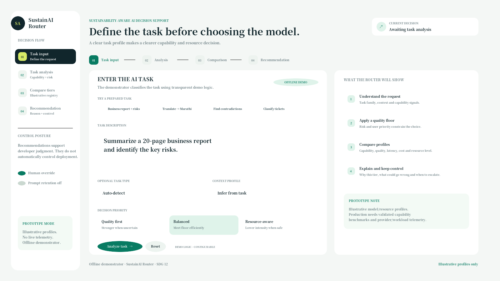
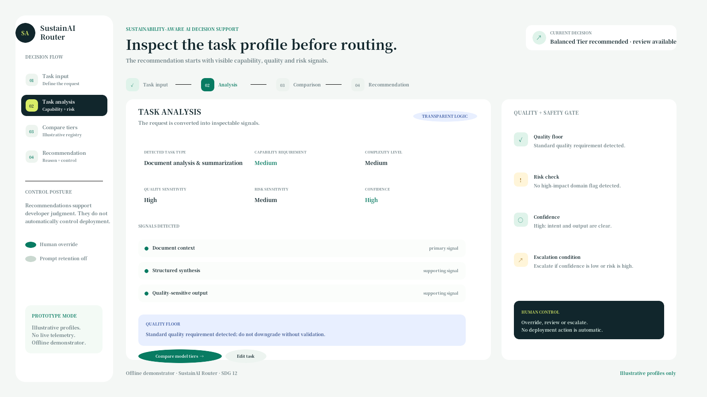
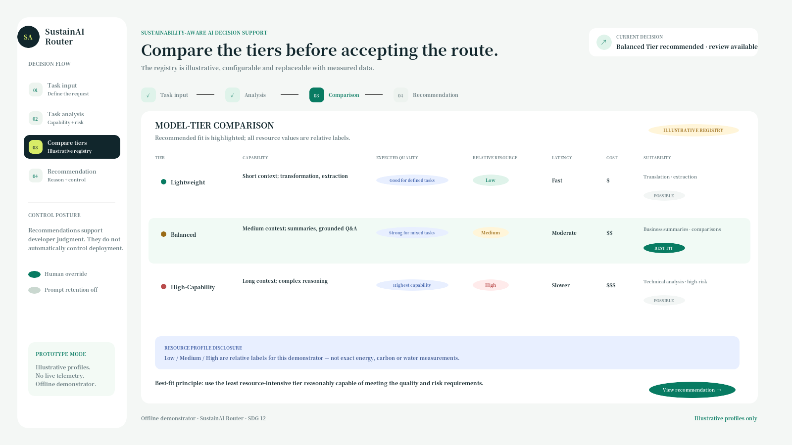
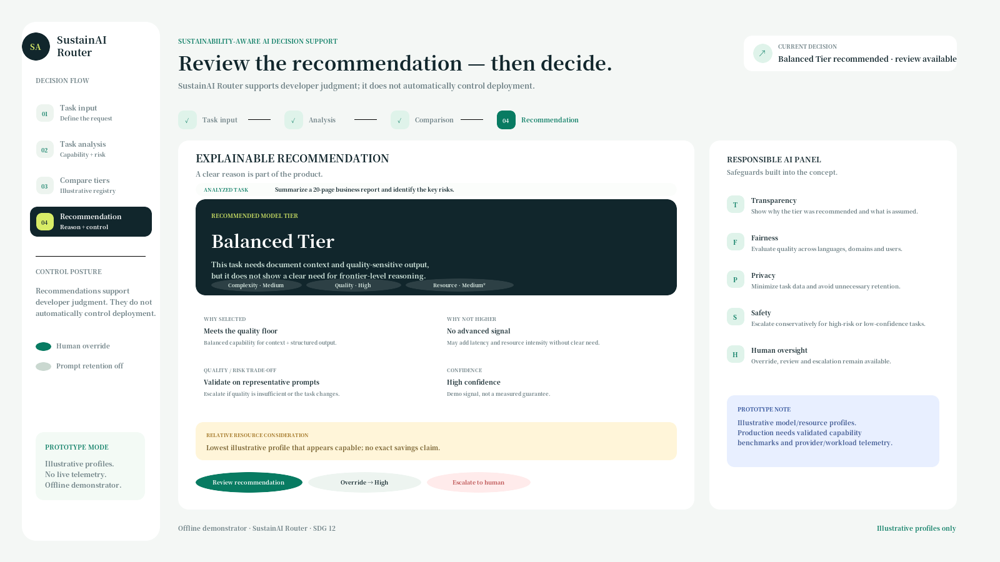
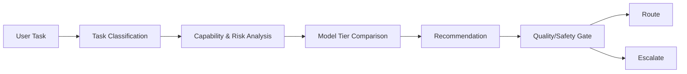

[README.md](https://github.com/user-attachments/files/32383418/README.md)
# SustainAI Router

**Explainable, resource-aware AI model-tier recommendation**

## Overview

SustainAI Router is an explainable decision-support prototype for recommending an appropriate AI model tier for a task. It connects task requirements with a configurable model-tier registry, considers quality, risk, capability and relative resource intensity, explains the trade-offs, and keeps human review and override in the loop. It is an offline concept demonstrator—not a production infrastructure router, environmental measurement tool or new routing algorithm.

## Problem Statement

One default model does not fit every task. Many AI applications use one model for everything: simple requests may be over-provisioned, while complex requests may be under-provisioned. Quality, capability, latency, cost and environmental/resource trade-offs can remain invisible at the application decision level.

The practical design question is not “always choose the smallest model” or “always choose the strongest model.” It is:

> Which capability is enough for this task while still meeting the required quality and safety floor?

Model routing and sustainability-aware infrastructure research already exist. SustainAI Router addresses a narrower decision-support and governance gap for teams that may not have private provider or infrastructure telemetry: making relative resource awareness, assumptions, quality safeguards and human control visible in the model-tier decision.

## Our Solution

SustainAI Router:

1. **Understands the AI task** by examining the request, task type, context and relevant signals.
2. **Classifies capability and complexity requirements** such as context needs, reasoning depth, output structure, language/tool needs and risk sensitivity.
3. **Compares model tiers** using an inspectable, configurable registry covering capability, expected quality, relative latency, relative cost and relative resource level.
4. **Recommends the least resource-intensive model tier reasonably capable of meeting quality and safety requirements.** This is a quality-constrained recommendation, not an automatic preference for the smallest model.
5. **Explains the recommendation and trade-offs** including why the tier was selected, why a higher tier may not be necessary, what is assumed and when validation is needed.
6. **Escalates when uncertainty or risk is high** through conservative fallback, human review and developer override.

## SDG Alignment

### Primary: SDG 12 — Responsible Consumption and Production

SustainAI Router supports SDG 12 by making resource-aware digital decisions more visible and encouraging capability to be matched with actual task requirements. Its focus is responsible technology consumption, organizational sustainability awareness and clearer information for decisions about AI model use.

The prototype does not claim to measure or reduce energy, carbon or water consumption. SDG 13 may be relevant to future measured implementation, but SDG 12 is the project’s primary alignment.

## AI Elements Used

- **Prompt Engineering** — the proposed workflow uses structured task-understanding prompts and explicit decision criteria.
- **AI Task Classification** — tasks are classified by family, complexity, capability requirement and risk signals.
- **Explainable AI** — the recommendation exposes its reason, trade-offs, assumptions and uncertainty.
- **Decision-Support AI** — the system supports developer judgment rather than automatically controlling deployment.
- **No-Code AI Workflow** — the planned no-code implementation can use a front end such as Glide, Softr or AppSheet; a Google Sheets/Airtable registry; and an optional AI or automation step.
- **Prototype technologies** — the delivered offline demonstrator is built with HTML, CSS and JavaScript. It uses transparent mock rules rather than live model/API calls.

## Target Users

| Target user | Need | Prototype response |
|---|---|---|
| AI product and developer teams | Balance capability, quality, latency, cost and resource efficiency | Model-tier recommendation and configurable policy registry |
| Enterprise copilot owners | Handle mixed, high-volume traffic responsibly | Task-to-tier workflow with quality and risk signals |
| AI SaaS platforms and platform operators | Govern an approved model pool | Inspectable tier comparison, policy controls and override |
| Sustainability / ESG teams | Avoid unsupported environmental claims | Relative resource labels, assumptions and disclosure notes |
| End users affected by routing quality | Receive reliable answers across languages and domains | Quality floor, confidence signals and escalation path |

## How the Prototype Works

The prototype presents a four-stage decision flow:

**Task Input → Task Analysis → Compare Tiers → Recommendation**

1. **Task Input** — enter a task, select optional context or risk signals, and choose a priority.
2. **Task Analysis** — inspect the detected task type, capability requirement, complexity, quality sensitivity, risk sensitivity, confidence and signals.
3. **Compare Tiers** — review the illustrative registry across capability, expected quality, relative resource, latency, cost and suitability.
4. **Recommendation** — review the recommended tier, explanation, trade-offs, resource disclosure, responsible-AI safeguards and available actions: review, override or escalate.

The prototype does not send or store prompts and does not automatically deploy or route a live request.

## Model Tiers

The prototype uses relative model/resource profiles. The labels describe an illustrative ordering, not measured real-world energy, carbon or water consumption.

| Tier | Intended capability profile | Illustrative use cases | Relative resource label | Relative latency |
|---|---|---|---|---|
| **Lightweight** | Short context; transformation, extraction and classification | Translation, field extraction, ticket triage and other bounded tasks | **Low** | Fast |
| **Balanced / Standard** | Medium context; summarization, grounded Q&A and structured instructions | Business summaries, FAQ answers and moderate comparisons | **Medium** | Moderate |
| **Advanced / High-Capability** | Long context; complex reasoning, contradiction analysis and tool workflows | Technical analysis, research synthesis and risk-sensitive review | **High** | Slower |

The relative resource labels are conceptual assumptions for the demonstrator. A production implementation would need validated capability benchmarks and provider/workload-specific telemetry. A lower-resource tier should only be selected when it is reasonably capable of meeting the task’s quality and risk requirements.

## Key Features

- Task classification
- Capability matching
- Resource-aware recommendation
- Explainable reasoning
- Quality and safety gate
- Human review and developer override
- Conservative escalation for uncertain or high-risk tasks

## Prototype Screenshots

The screenshots show the sequential offline demonstrator state.

### 01 — Task Input

### 02 — Task Analysis

### 03 — Model Comparison

### 04 — Recommendation

## Responsible AI

- **Transparency** — show task classification, recommendation reason, assumptions, evidence status, confidence and trade-offs.
- **Fairness** — evaluate routing across languages, domains and user groups; do not treat language identity as a proxy for low capability or low complexity.
- **Privacy** — minimize prompt retention, avoid unnecessary data collection, redact sensitive information in a real implementation and document provider data policies.
- **Human oversight** — developers can review, override or escalate recommendations; the prototype does not automatically control deployment.
- **Conservative escalation** — default upward or request human review when confidence is low, risk is high, quality is uncertain or language/domain support is unclear.
- **Quality and safety floor** — resource preference must not override minimum quality or safety requirements, especially for high-impact work.
- **Avoiding misleading environmental claims** — Low/Medium/High are relative illustrative labels only. The project does not present exact energy, carbon, water or savings figures.

## Expected Impact

The expected impact is deliberately stated without fabricated numerical savings:

- **Environmental:** make resource efficiency visible at the application decision level; no savings percentage is claimed.
- **Operational:** help teams identify possible over-provisioning for routine tasks while reserving higher-capability tiers for tasks that need them, subject to validation.
- **Economic:** create a basis for evaluating potential cost and latency efficiency at scale alongside quality and resource considerations.
- **Social:** improve awareness and decision transparency while preserving language, domain and user fairness safeguards.

Any real impact would need to be evaluated against representative workloads, quality outcomes and measured provider/workload data.

## Limitations

- This is an **offline prototype** and proof of concept.
- It makes **no live model/API calls** and does not perform production routing.
- It does not have access to **private provider telemetry**, GPU telemetry, data-centre measurements or carbon-intensity feeds.
- The **relative resource tiers are conceptual**, not measured real-world energy, carbon or water consumption.
- The delivered task classifier uses transparent mock rules and is not a validated learned routing model.
- Actual environmental impact varies by workload, prompt and output length, model, hardware, batching, serving stack, provider, location, grid mix, cooling system and measurement boundary.
- No environmental savings percentage, performance result or production-quality guarantee is claimed.

## Future Scope

The following are future work, not delivered prototype capabilities:

- Integrate real model APIs behind an approved model pool.
- Add provider/workload telemetry and measured energy or carbon data with documented measurement boundaries.
- Add validated quality benchmarks and representative multilingual and domain-specific evaluation.
- Replace conceptual resource labels with measured, evidence-backed model/resource metadata where available.
- Add production routing-system integration, policy controls, quality gates and outcome monitoring.
- Evaluate routing against baselines such as always-lightweight, always-advanced and policy-based selection.

## Project Workflow

## Project Status

**Prototype / Proof of Concept**

SustainAI Router is a student-level, explainable decision-support concept aligned primarily with SDG 12. It is not a production infrastructure router, live carbon optimizer, energy meter or footprint calculator.

## Files

| File or folder | Description |
|---|---|
| `SustainAI_Prototype.html` | Interactive offline HTML/CSS/JavaScript demonstrator with the four-stage decision flow. |
| `prototype_screens/` | PNG and editable SVG screenshots for task input, task analysis, model comparison and recommendation. |
| `SustainAI_Final_Presentation.pptx` | Final presentation covering the problem, evidence, existing field, gap, solution, prototype, impact, evaluation and responsible AI. |
| `SustainAI_Final_Project_Definition.md` | Final scope, problem definition, users, model registry, AI elements, responsible AI design and proposed evaluation. |
| `SustainAI_Research_Validation_Report.md` | Source-backed research validation, claim boundaries and evidence on routing, inference resources and carbon-aware systems. |
| `SustainAI_Existing_Solutions_Gap_Analysis.md` | Comparison of existing routing, gateway, energy and carbon-aware systems and the defensible project gap. |
| `SustainAI_Submission_Form_Answers.md` | Form-ready project description, solution, AI elements, impact, limitations and responsible-AI considerations. |
| `SustainAI_Evaluation_Matrix.csv` | Proposed evaluation matrix for classification, tier appropriateness, quality, explanations and fairness checks. |
| `SustainAI_Prototype_Changelog.md` | Prototype changes and final traceability fixes. |
| `SustainAI_FINAL_PROJECT_LOCK.md` | Concise source-of-truth decisions for name, positioning, SDG, scope and claim discipline. |

## Project Team

This is an **individual student project** developed for the **1M1B AI for Sustainability Virtual Internship**. The source project files do not specify an author name or additional team members, so no individual names are added here.

## License

**License: To be added.**
